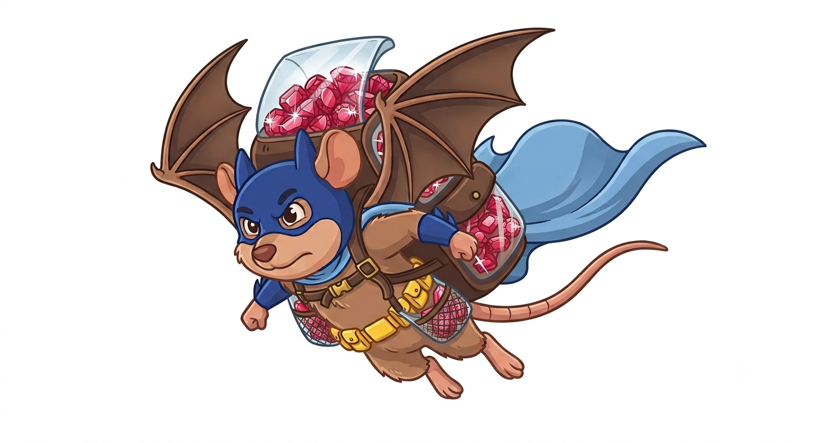

# ratalada



A DSL for running Rack servers as easily as you can in JavaScript.

```ruby
require "ratalada/puma"

Server.run do |request|
  case request
  in ["GET", "/"] then "hello\n"
  end
end
```

That's a whole app. Run the file, and it's listening on `http://127.0.0.1:9292`.

## Installation

```bash
gem install ratalada
```

Ratalada has no runtime dependencies of its own — install whichever server you
want to run on (`puma`, `falcon`, or `sinatra` for that flavour of DSL).

## Usage

Requiring a backend picks the server and defines the top-level `Server`
constant:

```ruby
require "ratalada/puma"    # or
require "ratalada/falcon"
```

The `Server.run` block is a router: it receives each request and returns a
handler for it. A request pattern-matches as `[verb, path]` (or by keys:
`in {verb:, path:, query:}`), and a handler can be:

- a `String` — sent as a `200 text/plain` response
- a callable — called with the request, its result handled the same way
- a `[status, headers, body]` triplet — used as-is
- nothing (`nil` or a fall-through `case ... in`) — a `404`

```ruby
require "ratalada/falcon"

Server.run do |request|
  case request
  in ["GET", "/"]      then "hello\n"
  in ["GET", "/up"]    then "ok\n"
  in ["POST", "/echo"] then ->(req) { [200, { "content-type" => "text/plain" }, req.body] }
  end
end
```

Prefer Sinatra's routing? Swap the frontend and keep whichever backend you
required:

```ruby
require "ratalada/falcon"
require "ratalada/sinatra"

Server.run do
  get "/" do
    "hello\n"
  end
end
```

The host and port default to `127.0.0.1:9292`, configurable via the `HOST` and
`PORT` environment variables or explicitly:

```ruby
Server.run(host: "0.0.0.0", port: 3000) do |request|
  # ...
end
```

Like node, one process is one event loop: plenty for IO-bound work, but only
one core of Ruby. To use more cores, `count:` (or the `COUNT` environment
variable) runs that many forked workers accepting from a shared socket — the
equivalent of node's `cluster` module, and with the same contract: each worker
has its own state, so anything shared between requests (sessions, caches)
needs an external store or `count: 1` (the default).

```ruby
Server.run(count: 4) do |request|
  # ...
end
```

Currently only the falcon backend forks workers; the puma backend warns and
ignores `count:`.

See [examples/](examples/) for complete runnable servers.

## Development

```bash
bin/setup     # install dependencies
bin/test      # run the tests
bin/console   # interactive prompt
```

## License

[MIT](LICENSE)
