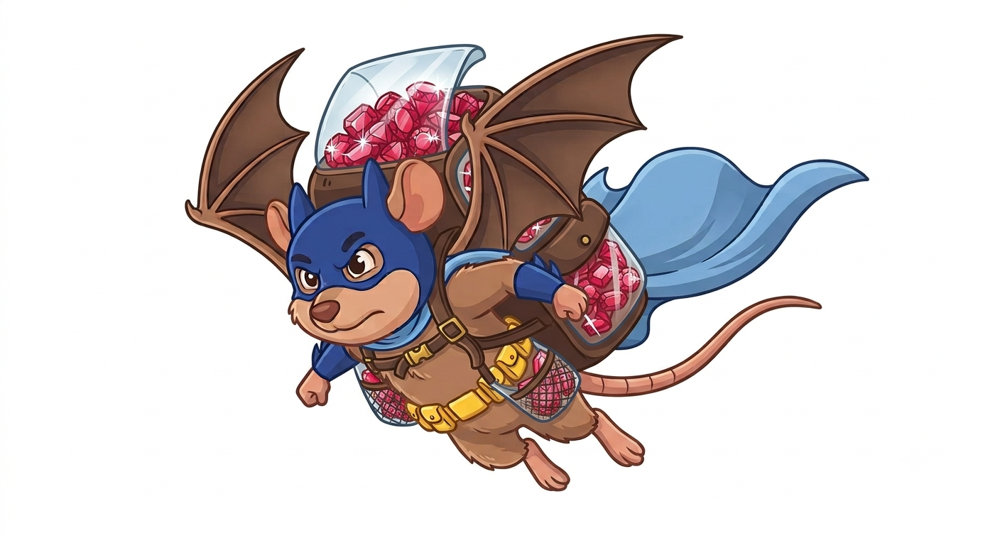

# ratalada



A DSL for running Rack servers as easily as you can in JavaScript.

```ruby
require "ratalada/puma"

Server.run do |request|
  case request
  in ["GET", "/"] then "hello\n"
  end
end
```

That's a whole app. Run the file, and it's listening on `http://127.0.0.1:9292`.

## Installation

```bash
gem install ratalada puma      # core + a server to run on
```

The core `ratalada` gem is the router, the backends, and the DSL. It has no
runtime dependencies of its own — install whichever server you run on (`puma`
or `falcon`).

The Sinatra, Grape, Hanami::API and Roda DSLs are optional add-ons, each its
own gem:

```bash
gem install ratalada-sinatra   # enables require "ratalada/sinatra"
gem install ratalada-grape     # enables require "ratalada/grape"
gem install ratalada-hanami    # enables require "ratalada/hanami"
gem install ratalada-roda      # enables require "ratalada/roda"
```

They ship separately because their dependencies conflict (Grape needs
`mustermann` 4; Sinatra and Hanami::API need `mustermann` 3), so bundling them
into `ratalada` would force you to pick one. **The require path is the same
either way**: install `ratalada-grape`, then `require "ratalada/grape"`. The adapter file
lives under the shared `ratalada/` namespace on the load path, so the `require`
never names the gem — only the file you want.

## Usage

Requiring a backend picks the server and defines the top-level `Server`
constant:

```ruby
require "ratalada/puma"    # or
require "ratalada/falcon"
```

The `Server.run` block is a router: it receives each request and returns a
handler for it. A request pattern-matches as `[verb, path]` (or by keys:
`in {verb:, path:, query:}`), and a handler can be:

- a `String` — sent as a `200 text/plain` response
- a callable — called with the request, its result handled the same way
- a `[status, headers, body]` triplet — used as-is
- nothing (`nil` or a fall-through `case ... in`) — a `404`

```ruby
require "ratalada/falcon"

Server.run do |request|
  case request
  in ["GET", "/"]      then "hello\n"
  in ["GET", "/up"]    then "ok\n"
  in ["POST", "/echo"] then ->(req) { [200, { "content-type" => "text/plain" }, req.body] }
  end
end
```

Prefer Sinatra's routing? Install `ratalada-sinatra`, then swap the frontend
and keep whichever backend you required:

```ruby
require "ratalada/falcon"
require "ratalada/sinatra"

Server.run do
  get "/" do
    "hello\n"
  end
end
```

Or Grape, from `ratalada-grape`:

```ruby
require "ratalada/falcon"
require "ratalada/grape"

Server.run do
  format :txt

  get "/" do
    "hello\n"
  end
end
```

### Middleware

`Server.use` chains, and `run` ends the chain:

```ruby
Server.use(Rack::CommonLogger).use(Rack::Deflater).run do |request|
  case request
  in ["GET", "/"] then "hello\n"
  end
end
```

These are plain rack middleware — they wrap the finished app and are handed
the `env`, so every middleware gem works unchanged — and they are built once at
boot, not per request. The first `use` in the chain is the outermost, as in
`Rack::Builder`. It works with any frontend, including Sinatra and Grape.

If you want rack's own builder DSL instead, `ratalada/builder` makes the
`Server.run` block a `Rack::Builder` block — `use`, `map` and `run`, built once:

```ruby
require "ratalada/puma"
require "ratalada/builder"

Server.run do
  use ExampleMiddleware
  map("/admin") { run AdminApp }

  run ->(env) { [200, { "content-type" => "text/plain" }, ["hello\n"]] }
end
```

That frontend is rack all the way down, so there is no `Request` sugar: `run`
hands you the raw env, and you return a full triplet yourself. It ships in the
core gem (rack is already there via whichever backend you run).

Or Hanami::API, from `ratalada-hanami`:

```ruby
require "ratalada/falcon"
require "ratalada/hanami"

Server.run do
  get "/" do
    "hello\n"
  end

  get "/users/:id" do
    json(id: params[:id])
  end

  # Hanami::API scopes middleware by path — this wraps /admin only.
  scope "admin" do
    use RequestId

    get "/" do
      "admin\n"
    end
  end
end
```

Or Roda's routing tree, from `ratalada-roda`:

```ruby
require "ratalada/falcon"
require "ratalada/roda"

Server.run do
  plugin :json

  route do |r|
    r.root do
      "hello\n"
    end

    # Branch once, act on the way down, match the verb last.
    r.on "users", Integer do |id|
      user = User[id]

      r.get "posts" do
        user.posts
      end

      r.is do
        user
      end
    end
  end
end
```

The block is Roda's class body, so `plugin` and `use` are available next to
`route`. The app is built with `.freeze.app`, Roda's recommended production
setup.

Requiring a frontend only changes how the block builds the app, not which
server runs it. Each of these adapters is a separate gem (`ratalada-sinatra`,
`ratalada-grape`), but the `require "ratalada/<name>"` line is all your code
ever sees.

The host and port default to `127.0.0.1:9292`, configurable via the `HOST` and
`PORT` environment variables or explicitly:

```ruby
Server.run(host: "0.0.0.0", port: 3000) do |request|
  # ...
end
```

Like node, one process is one event loop: plenty for IO-bound work, but only
one core of Ruby. To use more cores, `count:` (or the `COUNT` environment
variable) runs that many forked workers accepting from a shared socket — the
equivalent of node's `cluster` module, and with the same contract: each worker
has its own state, so anything shared between requests (sessions, caches)
needs an external store or `count: 1` (the default).

```ruby
Server.run(count: 4) do |request|
  # ...
end
```

Currently only the falcon backend forks workers; the puma backend warns and
ignores `count:`.

See [examples/](examples/) for complete runnable servers.

## Development

```bash
bin/setup     # install dependencies
bin/test      # run the tests
bin/console   # interactive prompt
```

One Gemfile covers the whole repository. None of its own gems are in the
bundle — the devshell puts `lib/` on `RUBYLIB` — so no lockfile records a
version and a bump has nothing to keep in step.

Each gem carries its own version, changelog (`CHANGELOG-<gem>.md`) and tag
(`<gem>-v1.2.3`), and is released on its own schedule with
[gem_kit-release](https://github.com/n-at-han-k/gem_kit):

```bash
gem kit bump patch --gem ratalada-roda   # move the version
gem kit changelog --write --gem ratalada-roda
gem kit release --gem ratalada-roda      # gate, build, push, tag
```

## License

[MIT](LICENSE)
